# OpsWitness Architecture

```mermaid
flowchart LR
  A[MCP Client or Agent Builder] --> P[OpsWitness MCP Trace/Proxy Endpoint]
  P --> PF[Capability-aware MCP Preflight]
  PF --> S[MCP Server for Splunk Platform]
  P --> Q[Portable Native Anomaly SPL]
  Q --> S
  P --> B[FastAPI Trace Collector]
  B --> C[Pydantic Event Normalizer]
  C --> D[Splunk HEC Evidence Index]
  D --> ACK[Optional Indexer Acknowledgement]
  D --> SD[Splunk Evidence Dashboard]
  C --> E[Persistent JSON Event Store]
  E --> F[Run Graph Reconstruction]
  F --> G[NetworkX Risk Path Analyzer]
  G --> H[Policy Findings]
  F --> I[Evidence Explainer]
  H --> I
  I --> J[OpsWitness UI]
  I --> K[Slack Incident Room]
  L[CI/CD Deployment Webhook] --> B
  J --> M[Human Approval Decision]
  M --> C

  subgraph Graph Nodes
    N1[Prompt]
    N2[Context Chunk]
    N3[MCP Tool Metadata]
    N4[Tool Call]
    N5[Splunk Search]
    N6[Policy Decision]
    N7[Human Approval]
    N8[Deployment]
    N9[Incident]
    N10[Remediation Proposal]
  end
```

OpsWitness turns real MCP JSON-RPC traffic into a causal context graph.
Splunk stores the searchable evidence trail through HEC. The graph layer
reconstructs why an action happened: which prompt, retrieved context, MCP tool
metadata, parameters, and policy decision led to a Splunk query or blocked action.

The Splunk dashboard remains a separate verification surface rather than an
embedded OpsWitness view. This lets operators and judges independently confirm
that the evidence displayed by OpsWitness was indexed and is queryable in
Splunk.

The preflight discovers the connected MCP server's live tool inventory before
using optional capabilities. HEC acknowledgement confirms indexing when the
configured token supports it, while `auto` mode preserves compatibility when it
does not. The anomaly path uses portable native SPL through `splunk_run_query`
and does not assume MLTK or hosted-model availability.

The repository also includes a Kuzu graph-store adapter for graph-native
experimentation. The validated runtime uses the persistent JSON event/graph
store for a dependency-light installation.
