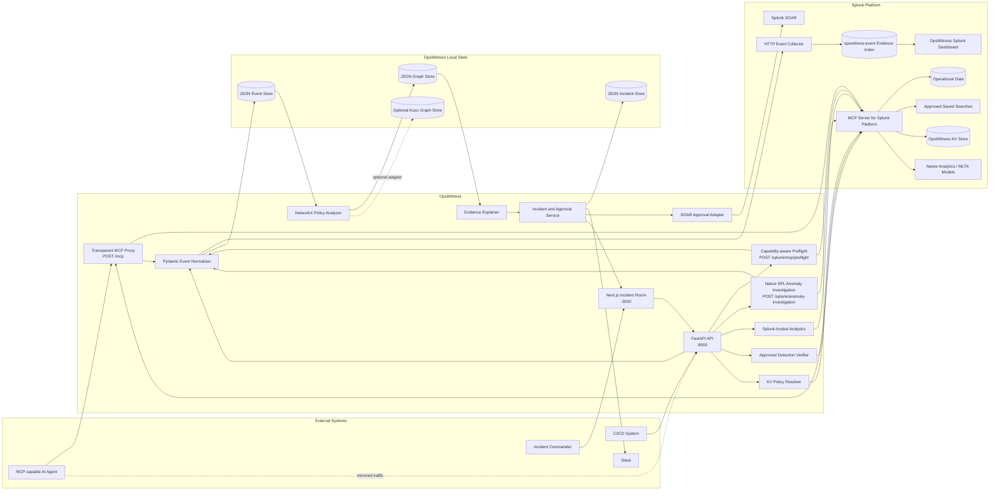
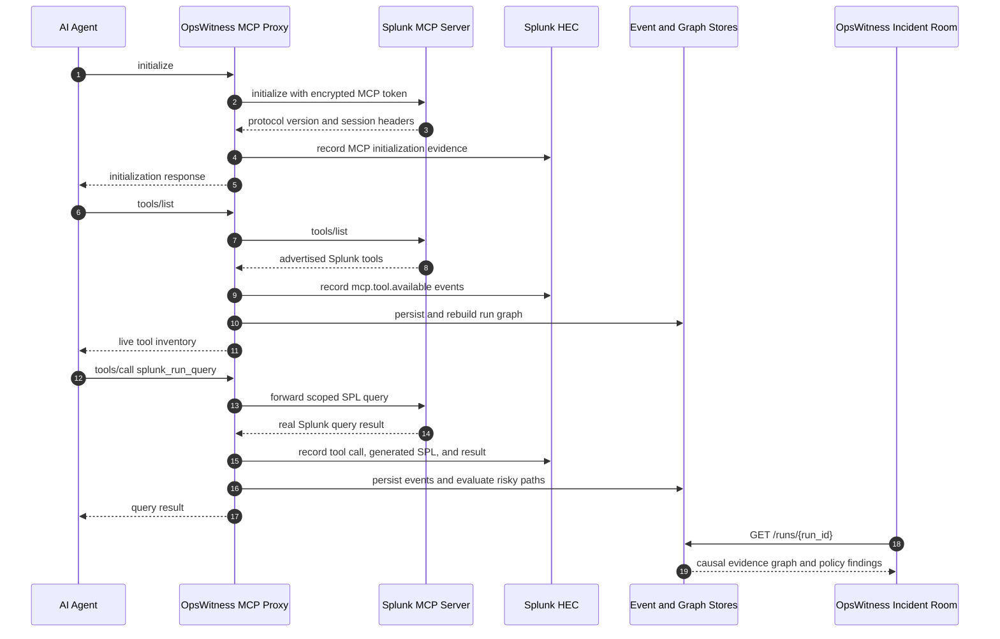
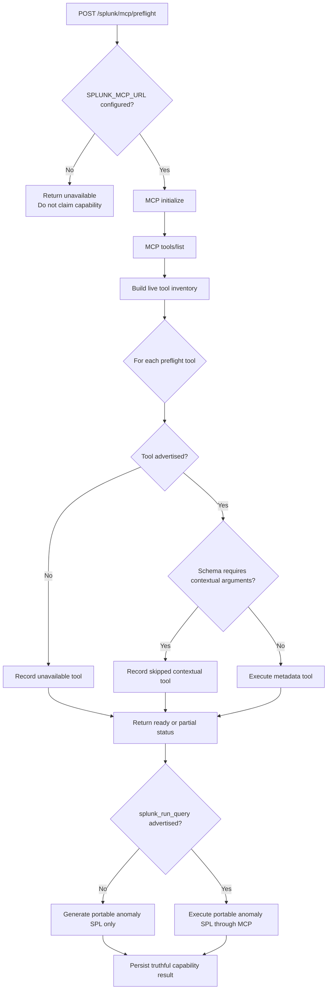
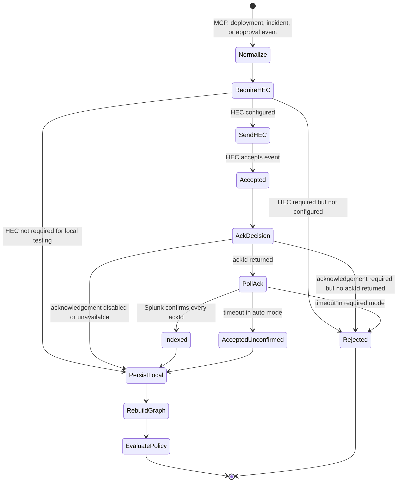
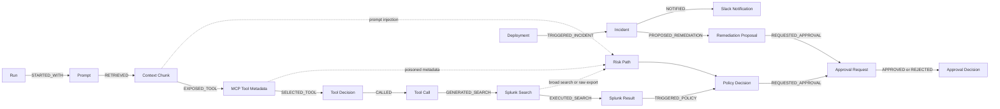
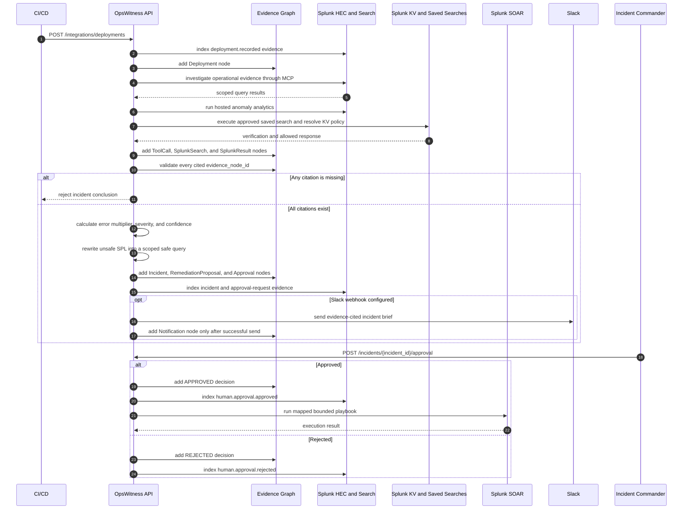
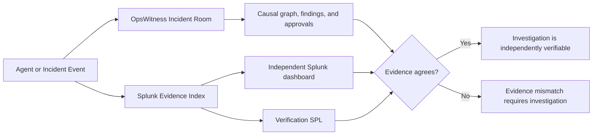

# OpsWitness Architecture

## System Context

## MCP Investigation And Evidence Capture

## Capability-aware Splunk Execution

## Evidence Persistence And HEC Acknowledgement

## Causal Evidence Graph

## Incident And Remediation Lifecycle

## Verification Surfaces

